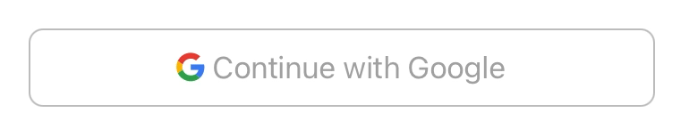
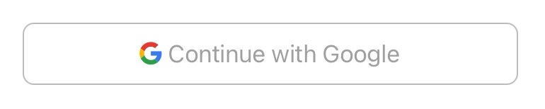

# RippleButton
A Google Material Design Mocked Button

## Usage

1. add RippleButton.swift to your project.
2. Assign your button the class RippleButton.
3. Play with the configurations to achieve what you need.

## Properties

| Property | Explanation | Default Value |
rippleColor: UIColor | The main ripple layer color | Grey with 0.2 Alpha |
overRippleColor: UIColor | The secondary ripple layer color | Grey with 0.2 Alpha |
initialRippleRadius: CGFloat | Initial main ripple radius | 10.0 |
initialOverRippleRadius: CGFloat | Initial secondary ripple radius | 5.0 |
rippleAnimationTime: TimeInterval | Time duration for the main ripple | 1.5 sec |
overRippleAnimationTime: TimeInterval | Time duration for the secondary ripple | 1.8 sec |
overRippleDelay: TimeInterval | Delay period before the secondary ripple starts | 0.1 sec |
shouldHighlightTitle: Bool | Enable/Disable default button title fade animation | true (Enabled) |
shouldShowOverRipple: Bool | Enable/Disable the secondary ripple animation | false (Disabled) |

## Demo

